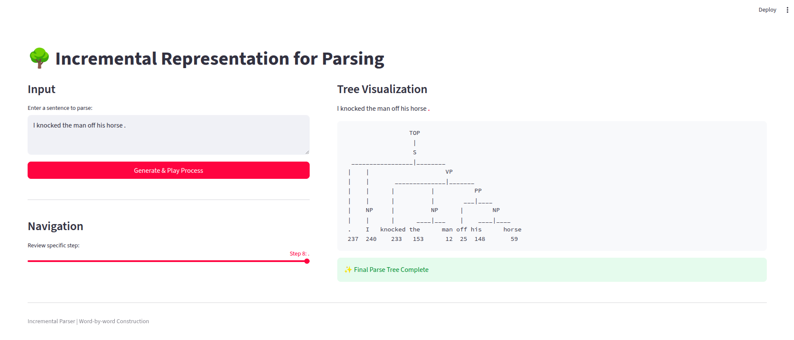

# [CS221] Incremental Representation for Parsing

Đồ án môn học: **Xử lý ngôn ngữ tự nhiên**
Giảng viên hướng dẫn: **TS. Nguyễn Thị Quý**

---

## 👥 Thành viên thực hiện
| Họ và tên | MSSV |
| :--- | :---: |
| Trần Ngọc Cẩm Nguyên | 23521061 |
| Ngô Phạm Phương Uyên | 23521762 |
| Dương Tấn Lộc | 23520854 |

---

## 📖 Giới thiệu dự án
Dự án tập trung tìm hiểu và thực nghiệm phương pháp **Incremental Representation for Parsing**. Đây là kỹ thuật biểu diễn dữ liệu giúp tối ưu hóa quá trình phân tích cú pháp theo cơ chế tuần tự, được công bố tại hội nghị ACL 2022.

* **Bài báo:** [Incremental Representation for Parsing (ACL 2022)](https://aclanthology.org/2022.acl-long.220.pdf)
* **Repository gốc:** [thomaslu2000/Incremental-Parsing-Representations](https://github.com/thomaslu2000/Incremental-Parsing-Representations)
* **Báo cáo chi tiết:** [`report.pdf`](report.pdf)
* **Notebook phân tích và đánh giá:**  [`analysis/IncrementalParsing.ipynb`](analysis/IncrementalParsing.ipynb)

---

## 🚀 Web Demo
Ứng dụng minh họa khả năng phân tích cú pháp của mô hình được xây dựng trên nền tảng Streamlit.



### Hướng dẫn khởi chạy:
1. Cài đặt các thư viện, setup, tải model theo repository gốc: [thomaslu2000/Incremental-Parsing-Representations](https://github.com/thomaslu2000/Incremental-Parsing-Representations)

2. Chạy ứng dụng:
```bash
streamlit run app.py
``` 